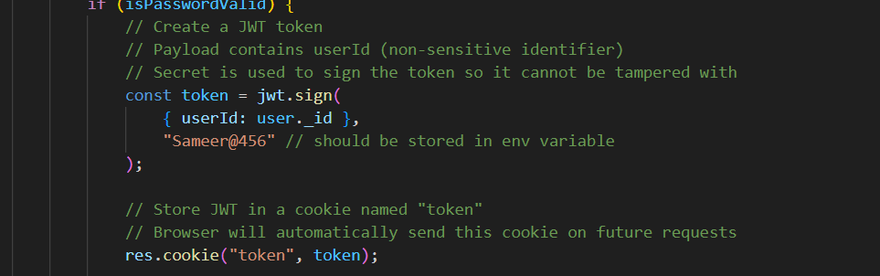
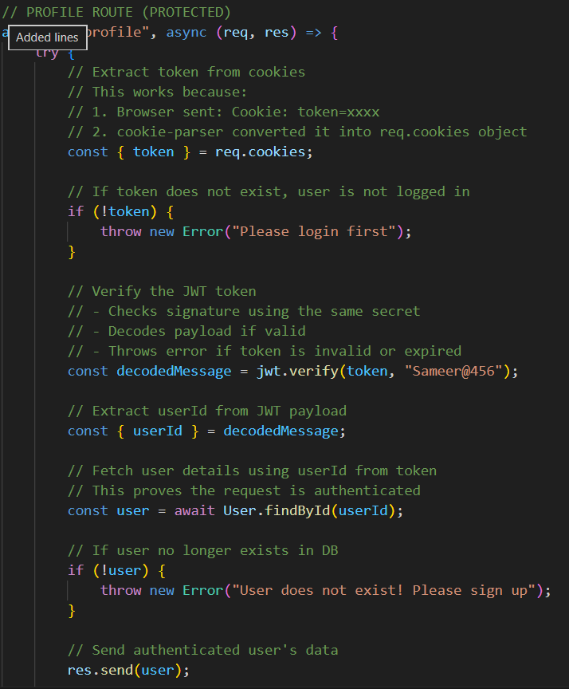

# 🌀 Event Loop Working (Node.js) 


## 1. Queues
- **Timers Queue** → `setTimeout`, `setInterval`
- **Poll Queue** → I/O callbacks (file, request, etc.)
- **Check Queue** → `setImmediate`
- **Close Queue** → close events (e.g. socket close)

## 2. Before Moving to Each Phase
- Runs `process.nextTick()`
- Runs **Promise callbacks (microtasks)**

## 3. Loop Behavior
- If **call stack is empty** and  
- All queues are empty →  
  👉 Event Loop **waits at Poll phase** for file, request, or other events

---

⚡ **Flow Summary:**
Sync code → Queues (Timers, Poll, Check, Close) → Microtasks (nextTick + Promises between phases) →  
Poll waits if nothing → Repeat

```js
const fs = require("fs");

setImmediate(() => console.log("setImmediate"));

setTimeout(() => console.log("Timer expired"), 0);

Promise.resolve("promise").then(console.log);

fs.readFile("./file.txt", "utf8", () => {
    setTimeout(() => console.log("2nd timer"), 0);

    process.nextTick(() => console.log("2nd nextTick"));

    setImmediate(() => console.log("2nd setImmediate"));

    console.log("File reading CB");
});

process.nextTick(() => console.log("Process.nextTick"));

console.log("Last line of the file");
//Output : 
// Last line of the file
// Process.nextTick
// promise
// Timer expired
// setImmediate
// File reading CB
// 2nd nextTick
// 2nd setImmediate
// 2nd timer

```
* A full cycle of event loop is known as one "Tick".

* epoll uses Red-Black Tree. Timers queue uses min-heap.

## Is JavaScript single-threaded or multi-threaded?  

- **JavaScript itself** → Single-threaded (executes on the main thread).  
- **When no asynchronous tasks** → runs purely single-threaded.  
- **When asynchronous tasks** (e.g., `fs`, `dns`, `crypto`) →  
  - These use **libuv’s threadpool** under the hood.  
  - So Node.js can make use of **multiple threads in the background**, while JS code still runs on one thread.  

---

## Can you change the threadpool size?  

✅ **Yes.**  

Set via environment variable:  
```js
process.env.UV_THREADPOOL_SIZE = 8;
```

- Default = 4

- Maximum = 128

## Do APIs use the thread pool?

❌ **No.**

- Networking tasks in Node.js (APIs, HTTP requests, sockets) do **not** use libuv’s thread pool.
- Instead, they rely on **OS-level mechanisms**:
  - **epoll** (Linux)
  - **kqueue** (macOS)

---

## Why not threads?

- If every request had its own thread → thousands of threads → ❌ inefficient.
- OS provides **efficient event notification systems** (epoll/kqueue).
- These can monitor **many sockets at once** without needing one thread per connection.

---

## How it works

- **Sockets** = file descriptors.
- OS kernel monitors them via **epoll/kqueue**.
- When activity happens (e.g., new request, data ready), the kernel notifies **libuv**.
- Node.js then processes it **asynchronously** on the single main thread.

---

✅ **Result:** Node.js can handle **thousands of connections** efficiently **without using the thread pool**.

# Node.js Notes

## What is a Server? 🖥️

A server can mean two things depending on context:

* **- **Hardware:** 🧱 A physical computer that provides resources or services to other machines over a network.*
* **- **Software:** ⚙️ A program that listens for requests and sends back responses.*

### Deploying an App on a Server 🚀

When someone says "deploy your app on a server," it usually means:

* 🖥️ You need a physical or virtual machine to run your app.
* 💿 That machine has an OS like Linux or Windows.
* 📡 Server software (like Node.js or Apache) handles incoming user requests.

## AWS and Cloud Computing ☁️

AWS provides cloud-based resources that let you run your applications without worrying about physical machines.

* **AWS (Amazon Web Services):** A platform that gives you access to servers, storage, databases, and more over the internet.
* **EC2 Instance:** 🖥️ When you launch one, you're renting a virtual server. AWS handles the hardware, networking, cooling, and reliability. You just deploy your application on the virtual machine.
* **Scalability:** 📈 You can increase or decrease RAM, CPU, or storage whenever needed. This is far easier compared to upgrading a personal computer.
* **Reliability:** 🔌 AWS data centers have backup power, strong internet, and redundant systems so your app stays available even if something fails.

## Can You Use Your Laptop as a Server? 💻

Yes, but with several limitations:

* **Hardware Constraints:** Laptops are not built for heavy server loads. Limited RAM, CPU, and storage make them unsuitable for handling many requests.
* **Internet Limitations:** Home internet is unstable, slower, and usually has dynamic IPs. Hosting a public server requires stable connectivity and a fixed IP.
* **Power & Maintenance:** Keeping a laptop running 24/7, managing heat, and ensuring backup power is difficult. Cloud providers automatically handle all these issues.
  ? 💻
  Yes, but with limitations:
* **Hardware:** Limited RAM/CPU/storage.
* **Internet:** Home networks are unstable and often use dynamic IPs.
* **Power & Maintenance:** Keeping it always on is tough. Cloud handles this.

## Software Servers in Node.js ⚙️

Creating an HTTP server means building an app that listens for client requests and responds.

## Client-Server Architecture 🌐

* **Client:** The user or browser accessing resources.
* **Socket Connection:** Temporary connection between client and server.
* **Multiple Clients:** Each opens its own socket, gets data, closes it.
* **Based on TCP/IP:** Protocols that manage reliable data transfer.

## What Is a Protocol? 📜

Rules for how computers communicate.

* **FTP:** File transfers.
* **SMTP:** Sending emails.
* **HTTP:** Main protocol for web servers.

## How Is Data Sent in a Server Request? 📦

* Data is broken into **packets**.
* TCP/IP handles sending and managing these packets.
* In Node.js, **streams** and **buffers** help handle data transmission.

## Domain Names and DNS 🌍

We don’t normally type IP addresses like `142.250.190.14` into the browser. Instead, we use names like **youtube.com**, because humans remember words far better than long number strings. But behind the scenes, every domain eventually maps to an IP address.

This works very similar to how you save contacts on your phone. You tap on "Mom" instead of remembering her phone number, but the phone still uses the number internally. In the same way, when you type a URL, your system converts it into an IP address.

### How DNS Works 🧭

* **DNS (Domain Name System)** is like the internet's phonebook.
* When you enter a domain name, your browser asks a DNS server to find the matching IP address.
* Once the DNS server returns the correct IP, your device sends a request directly to that server.

### What Happens Behind the Scenes 🔍

After the IP is resolved, your browser sends a request to the server where an **HTTP server** processes it.

* The server responds with the requested data.
* The data isn’t sent all at once. It’s broken into **chunks**, also known as **streams**.
* While receiving these chunks, your browser uses **buffers** to manage the flow of data.

This is why videos sometimes **buffer**. The browser is waiting for enough chunks to arrive before playing smoothly.

## Creating Multiple Servers 🔌

You can create multiple HTTP servers in Node.js. Each server runs as a separate application, and the way we differentiate them is through **ports**.

### How Do We Know Which Server a Request Should Go To?

If you create two Node.js servers, you're essentially running two different applications. Each one listens on a unique port such as **3000**, **3001**, etc.

Example:

* An HTTP server running on **IP: 102.209.1.3** and **port: 3000** is reached using **102.209.1.3:3000**.
* The same machine can run another server on **port 3001**, accessed via **102.209.1.3:3001**.

A single computer can host many applications. The **port number** helps the operating system route the incoming request to the correct application.

## Mapping Domains, IPs, Ports, and Paths 🌐

When you enter a domain like `youtube.com`, the DNS resolves it to an IP address. That IP identifies the server. After that:

* **IP + port** identifies which application on that server should handle the request.
* **IP + port + path** identifies which route or API should be invoked.

Examples:

* **102.209.1.3:3000** could host a React app.
* **102.209.1.3:3001** could host a Node.js API.

Paths allow more structure:

* `youtube.com` → React (port 3000)
* `youtube.com/api/...` → Node.js (port 3001)

Example configuration for **namastedev.com**:

* `namastedev.com` → React on port 3000
* `namastedev.com/node` → Node.js on port 3001

This setup helps manage multiple applications on a single server using ports and paths.

## Distributed Server Architecture 🏗️

Large companies rarely use a single server for everything. Instead, they distribute responsibilities across multiple servers.

### 1. Frontend Server

Serves HTML, CSS, JS files. This is what users see and interact with.

### 2. Backend Server

Handles business logic, processes requests, interacts with databases.

### 3. Dedicated Database Server

Optimized only for storing and retrieving data. Backend communicates with this server.

### 4. Media and File Servers

Videos, images, and large files are hosted separately, often via CDNs for fast global delivery.

### 5. Inter-Server Communication

Frontend and backend servers request data from media servers, database servers, or other microservices.

Example architecture for **namastedev.com**:

* **Frontend + Backend:** Hosted on AWS
* **Database:** Separate database server
* **Videos:** Media server optimized for streaming
* **Images:** CDN for fast delivery

This distributed approach improves scalability, reliability, and performance.

## Socket vs WebSockets 🧵

### Regular Sockets

* A socket connection is created when a client makes a request.
* The server responds.
* The connection closes.
* For every new request, a new socket connection must be created.

This is fine for normal websites but inefficient for real-time apps.

### WebSockets

WebSockets create a **persistent open connection**.

* After the initial handshake, the connection stays open.
* Both client and server can send data anytime.
* No need to reconnect for each message.

Perfect for:

* Chat apps
* Live notifications
* Online gaming
* Real-time dashboards


## Databases – SQL & NoSQL

### What Is a Database? 🗄️

A database is an organized collection of data, managed using a **Database Management System (DBMS)**. It interacts with users, applications, and the data itself to store, process, and retrieve information.  

---

## Types of Databases

### 1. Relational Databases (RDBMS) – MySQL, PostgreSQL 🧩

They use structured tables with predefined schemas. Great for complex queries, ACID transactions, and strong data integrity.  

### 2. NoSQL Databases – MongoDB 📄

Store flexible JSON-like documents with dynamic schemas. Highly scalable and ideal for unstructured or semi-structured data.  

### 3. In-Memory Databases – Redis ⚡

Stores data in memory for extremely fast access. Used for caching, analytics, message brokering.  

### 4. Distributed SQL – CockroachDB 🌍

Horizontally scalable SQL database with strong consistency and ACID transactions.  

### 5. Time-Series DB – InfluxDB ⏱️

Optimized for time-stamped data, monitoring, IoT, and real-time analytics.  

### 6. Object-Oriented DB – db4o 🧱

Stores data as objects directly, matching object-oriented programming models.  

### 7. Graph DB – Neo4j 🕸️

Handles complex relationships using nodes and edges. Used in social networks, recommendation systems.  

### 8. Hierarchical DB – IBM IMS 🌳

Stores data in parent-child tree structures. Used in legacy high-performance systems.  

### 9. Network DB – IDMS 🔗

More complex relationships than hierarchical DBs. Used in legacy systems.  

### 10. Cloud DB – Amazon RDS ☁️

Managed relational DB service supporting MySQL, PostgreSQL, Oracle. Handles backups, patching, scaling. 

Most commonly used:

* **Relational DB**
* **NoSQL DB**

---

## RDBMS: The Story Behind MySQL & PostgreSQL

### EF Codd & Codd’s 12 Rules 📐

EF Codd introduced 12 rules (numbered 0–12) defining what makes a database *relational*. Must have multiple tables and relationships.  

### MySQL Origin Story 👶

Created by **Michael Widenius**. Named after his daughter *My*. Later forks:

* **MaxDB** after son Max
* **MariaDB** after daughter Maria
  MySQL was acquired by Sun Microsystems, later by Oracle. MariaDB was created as a fork.  

### PostgreSQL Origin Story 🧑‍🏫

Created by **Michael Stonebraker** during the Ingres project. Successor project “Post Ingres” evolved into PostgreSQL, using SQL heavily for data querying.  

---

## NoSQL & MongoDB

Types of NoSQL Databases:

1. Document DBs
2. Key-Value DBs
3. Graph DBs
4. Wide-Column DBs
5. Multi-Model DBs

MongoDB (created in **2009**) works extremely well with JavaScript and JSON. The name comes from “humongous,” highlighting its ability to handle huge data. Built by **10gen** (now MongoDB Inc.).  

---

## RDBMS vs NoSQL (Document DB)

### RDBMS

* Uses **tables** (rows & columns)
* Uses **foreign keys** for relationships
* Requires **normalization** to remove redundancy
* Often needs **joins** to fetch related data
* Fixed schema

### NoSQL (e.g., MongoDB)

* Uses flexible **document structures** (JSON-like)
* Groups records in **collections** instead of tables
* Stores related data in a **single document** (no joins needed)
* Schema is **dynamic and flexible**
* Integrates naturally with JavaScript

### Key Differences

* **Structure:** Tables vs documents
* **Schema:** Fixed vs flexible
* **Query Language:** SQL vs custom queries
* **Scaling:** RDBMS struggles with horizontal scaling; NoSQL excels at it
* **Use Cases:** RDBMS for transactions; NoSQL for high-performance, flexible data models
* **Examples:** Banking apps (RDBMS) vs content systems, real-time analytics (NoSQL)  

### Why `node_modules` Gets So Big

* Installing **express** also installs its **dependencies**.
* Each dependency has **its own dependencies**.
* This creates a **recursive chain** of installs.
* If packages need **different versions** of the same library, both versions get installed.
* NPM often uses **nested folders**, not a flat structure.
* Result: `node_modules` becomes large with many subfolders.

# SemVer Version Range Notes

## Version Format

`major.minor.patch`

* **Major**: breaking changes
* **Minor**: new features
* **Patch**: bug fixes

## Range Symbols

### `^` (caret)

* Allows: **minor + patch** updates
* Blocks: major updates
* Example: `^4.19.2` → `>=4.19.2 <5.0.0`

### `~` (tilde)

* Allows: **patch** updates only
* Blocks: minor + major updates
* Example: `~4.19.2` → `>=4.19.2 <4.20.0`

### Exact Version

* No updates allowed
* Example: `4.19.2`

### `*` (wildcard)

* Allows **all updates**, including major
* Equivalent to "any version"

## Quick Table

| Symbol | Major | Minor | Patch |
| ------ | ----- | ----- | ----- |
| `^`    | ❌     | ✔     | ✔     |
| `~`    | ❌     | ❌     | ✔     |
| Exact  | ❌     | ❌     | ❌     |
| `*`    | ✔     | ✔     | ✔     |

# package.json & package-lock.json

## package.json (What it is)

* **Purpose:** The manifest and primary configuration for a Node.js project.
* **Contains:**

  * Project metadata (name, version, description, author, license).
  * Scripts (`scripts`) like `start`, `test`, `build`.
  * Dependency lists: `dependencies`, `devDependencies`, `peerDependencies`, `optionalDependencies`.
  * Engine requirements (e.g., Node version), entry point (`main`), repository info.
* **Version specs:** Uses semver ranges (e.g., `^`, `~`, exact). These are *intentions*, not locked results.
* **Edited by:** Developers (via `npm init`, manual edits, or `npm install <pkg> --save`).

### Why package.json matters

* It tells npm and other developers **what the project needs** and how to run it.
* CI/CD systems and package registries read it to know build steps, test commands, and publish metadata.

---

## package-lock.json (What it is)

* **Purpose:** A deterministic snapshot of the entire dependency tree installed by npm.
* **Contains:** Exact package versions, resolved URLs, integrity hashes, and the full nested dependency graph (every sub-dependency and its exact version).
* **Generated by:** npm automatically when you run `npm install` or alter dependencies.
* **Not for manual edits.** Treat it like a machine-generated manifest.

### Why package-lock.json is crucial

* **Reproducible installs:** Ensures every developer, CI server, and production environment installs the *same* versions.
* **Stability and safety:** Prevents sudden, silent updates (e.g., a minor release that introduces a bug) from breaking your project.
* **Performance:** Faster installs because npm resolves fewer version decisions when a lockfile exists.

# npm `-g` Flag — Short Notes

## What `-g` Means

`-g` installs a package **globally** (system-wide), not inside your project folder.

---

## When to Use `-g`

Use it only for **command-line tools**, for example:

* nodemon
* typescript (`tsc`)
* http-server
* eslint (optional)
* prettier (optional)

These tools are meant to be run from the terminal anywhere on your system.

---

## When NOT to Use `-g`

Do **not** use `-g` for packages you `require()` in code, such as:

* express
* mongoose
* bcrypt
* dotenv
* jsonwebtoken
* react

These must be installed **locally** inside the project.

---

## Why Not Install Everything Globally?

* Global installs do **not** update `package.json`.
* They **cannot** be required inside your project.
* They break project version management.
* They cause conflicts across different projects.
* Projects become non-reproducible for others.

---

## Simple Rule

**Global = CLI tools**
**Local = project dependencies**

# Express: `app.use()` vs `app.get()` / `app.post()`

## Code Example

```js
app.use("/user", (req, res) => {
  res.send("User method overrided");
});

app.get("/user", (req, res) => {
  res.send({ firstName: "Sameer", lastName: "Syed" });
});

app.post("/user", (req, res) => {
  res.send("Data successfully saved to the database");
});
```

---

## `app.use("/user")`

* Runs for **ALL HTTP methods** (GET, POST, PUT, DELETE, etc.).
* Matches **any route starting with `/user`**.
* Commonly used for **middleware**, not final responses.
* If it sends a response and does **not call `next()`**, request handling **stops here**.

---

## `app.get("/user")`

* Runs **only for GET requests** to `/user`.
* Used for **fetching data**.
* More specific and safer for endpoints.

---

## `app.post("/user")`

* Runs **only for POST requests** to `/user`.
* Used for **sending or saving data**.

---

## Why Order Matters

* Express executes routes **top to bottom**.
* First matching route that sends a response **ends the request cycle**.
* Since `app.use("/user")` matches all methods, it captures requests before `get` or `post`.

---

## How `app.use()` Overrides Others

* `app.use("/user")` matches `/user` GET and POST.
* It sends a response immediately.
* `app.get()` and `app.post()` never run.

---

## Fix (Recommended Order)

```js
app.get("/user", ...);
app.post("/user", ...);
app.use("/user", middlewareFn);
```
# Express Routes: Pattern Symbols + Regex (Short Notes)

Express routes support **pattern symbols** and **regular expressions** to match flexible URLs.

---

## Route Pattern Symbols

### `?` (Optional)

* Makes the preceding character or group optional.

```js
app.get('/user?', handler);
```

Matches: `/use`, `/user`

---

### `+` (One or More)

* Matches the preceding character one or more times.

```js
app.get('/user+', handler);
```

Matches: `/user`, `/userr`, `/userrrr`

---

### `*` (Anything)

* Matches any characters after the prefix.

```js
app.get('/user*', handler);
```

Matches: `/user`, `/user123`, `/user/profile`

---

### `()` (Grouping)

* Groups parts of a route together.

```js
app.get('/user(id)?', handler);
```

Matches: `/user`, `/userid`

---

## Regex Routes

### Basic Regex

```js
app.get(/user/, handler);
```

Matches any URL containing `user`.

---

### Start and End Anchors

```js
app.get(/^\/user$/, handler);
```

Matches only `/user`.

---

### Character Sets

```js
app.get(/user[0-9]/, handler);
```

Matches: `/user1`, `/user5`

---

### Optional Parts in Regex

```js
app.get(/user(s)?/, handler);
```

Matches: `/user`, `/users`

---

## Important Rules

* Routes are matched **top to bottom**.
* Pattern and regex routes can **override others** if placed first.
* Regex is more powerful but **less readable**.

---

## When to Use What

* Use **pattern symbols** for simple flexibility.
* Use **regex** for complex or unpredictable URLs.
* Prefer normal routes or params (`/user/:id`) when possible.

# Express: Query Parameters (Short Notes)

## Code Example

```js
app.get("/user", (req, res) => {
  console.log(req.query);
  res.send({ firstName: "Sameer", lastName: "Syed" });
});
```

URL:

```
http://localhost:3000/user?userId=101&userNum=9654
```

---

## What Are Query Parameters?

* Key–value pairs sent in the **URL after `?`**.
* Used mainly with **GET requests**.
* Do not change server state.

---

## `req.query`

* Express automatically parses query parameters.
* Available as an **object**.

Example value of `req.query`:

```js
{
  userId: '101',
  userNum: '9654'
}
```

(Note: values are strings by default.)

---

## When to Use Query Params

* Filtering data
* Searching
* Pagination
* Optional parameters

---

## Key Notes

* Query params are **visible in the URL**.
* Best for **read-only operations**.
* Order of query params does not matter.

---

## Route Parameters (Path Params)

### Code Example

```js
app.get("/user/:userId/:userName/:pwd", (req, res) => {
  console.log(req.params);
  res.send({ firstName: "Sameer", lastName: "Syed" });
});
```

URL:

```
http://localhost:3000/user/707/Habeebi/Dubai@123
```

---

## `req.params`

* Used to capture **dynamic values from the URL path**.
* Values are mapped based on position.

Example value of `req.params`:

```js
{
  userId: '707',
  userName: 'Habeebi',
  pwd: 'Dubai@123'
}
```

---

## Route Params vs Query Params

* **Route params**: required, part of the URL path.
* **Query params**: optional, after `?` in the URL.

---

## When to Use Route Params

* Identifying a specific resource (user ID, product ID)
* Mandatory values
* Clean, REST-style URLs

# Express: Multiple Route Handlers & `next()` (Short Notes)

## Code Example

```js
app.get("/user",
  (req, res, next) => {
    console.log("Handling the route user 1");
    next();
  },
  (req, res) => {
    console.log("Handling the route user 2");
    res.send("Response 2");
  }
);
```

---

## What Is Happening

* A single route (`/user`) has **multiple handler functions**.
* Handlers execute **in order**, left to right.

---

## `next()`

* `next()` passes control to the **next handler** in the chain.
* If `next()` is NOT called, the request **stops** at that handler.

---

## Execution Flow

1. First handler runs → logs message
2. `next()` is called
3. Second handler runs → sends response

---

## Important Rules

* Only **one response** should be sent.
* Once `res.send()` is called, the request ends.
* Calling `next()` after `res.send()` is an error.

---

## Handlers Inside an Array

* Route handlers can also be wrapped inside an **array**.
* Using an array has **no impact on behavior**.
* Express flattens the array and executes handlers in order.

### Example:

```js
app.get("/user", [
  (req, res, next) => {
    console.log("Handler 1");
    next();
  },
  (req, res) => {
    res.send("Response");
  }
]);
```

* Useful for grouping or reusing middleware sets.

# Express Middleware: Different Ways to Use It (Short Notes)

Middleware functions can be applied in **multiple ways** depending on scope and reuse needs.

---

## 1. Route-level Middleware (Inline)

```js
app.get("/user", userAuth, (req, res) => {
  res.send("User data sent");
});
```

* Middleware runs **only for this route**.
* Useful for **specific checks** (auth, validation).

---

## 2. Route-level Middleware (Multiple)

```js
app.get("/user", userAuth, anotherMiddleware, handler);
```

* Multiple middlewares run **in order** before the handler.

---

## 3. Path-based Middleware (using `app.use`)

```js
app.use("/admin", adminAuth);
```

* Middleware runs for **all routes starting with `/admin`**.
* Best for protecting a group of routes.

---

## 4. Middleware + Route Handler Together

```js
app.get("/admin/getAllData", adminAuth, (req, res) => {
  res.send("All user data sent");
});
```

* Middleware applies **only to this endpoint**, not all `/admin` routes.

---

## 5. Imported Middleware from Separate File

```js
const { adminAuth, userAuth } = require('./middlewares/auth');
```

* Keeps code **clean and reusable**.
* Same middleware can be used across multiple routes.

---

## Key Takeaway

* Use **route-level middleware** for specific endpoints.
* Use **`app.use()`** for grouping and global protection.
* Middleware always runs **before** the final response handler.
```js
app.get("/getUserData", (req, res) => {
    try{
        throw new Error("dsfhsdjhf");
        res.send("User data sent");
    }
    catch(err){
        res.status(500).send("Contact SFT");
    }
})
```

# Express: Error Handling (Short Notes)

Express supports **centralized error handling** using special middleware, instead of repeating try–catch everywhere.

---

## 1. Error Thrown Inside Route (Without try–catch)

```js
app.get("/getUserData", (req, res) => {
  throw new Error("Something went wrong");
});
```

* Errors thrown synchronously are **automatically passed** to error-handling middleware.
* Cleaner than wrapping every route in try–catch.

---

## 2. Error-Handling Middleware

```js
app.use((err, req, res, next) => {
  res.status(500).send("Contact support team");
});
```

* Identified by **4 parameters**: `(err, req, res, next)`.
* Must be placed **after all routes**.
* Handles errors from all routes in one place.

---

## 3. Using try–catch Inside Routes

```js
app.get("/getUserData", (req, res) => {
  try {
    throw new Error("Something went wrong");
  } catch (err) {
    res.status(500).send("Contact SFT");
  }
});
```

* Works, but leads to **duplicate error-handling code**.
* Harder to maintain in large apps.

---

## 4. Why Central Error Handling Is Better

* Avoids repeated try–catch blocks
* Cleaner and more readable routes
* One place to manage logging and responses
* Easier to change error behavior globally

---

## Important Rules

* Error middleware **must be last**.
* Calling `next(err)` manually also triggers error middleware.
* Only one response should be sent.

---

## Best Practice

* Throw errors in routes
* Handle them in a **single error-handling middleware**
* Use try–catch only when you need custom handling


# Cookies and JWT – Authentication Notes (Express.js)

These notes explain **what cookies are**, **what JWT is**, **why they are used**, and **how they work together** using the Express.js login/profile example.

---

## 1. What is a Cookie?

A **cookie** is a small key–value pair stored in the **user’s browser** by a server.

### Key points about cookies

* Stored on the **client (browser)**
* Automatically sent with every request to the same domain
* Used to maintain login state, preferences, sessions, etc.

Example cookie:

```
token=eyJhbGciOiJIUzI1NiIsInR5cCI6IkpXVCJ9...
```

### Why cookies are useful

* Browser handles sending them automatically
* No need to manually attach data in every request
* Can be secured using flags like:

  * `httpOnly` (JS cannot access it)
  * `secure` (HTTPS only)
  * `sameSite` (CSRF protection)

---

## 2. What is JWT (JSON Web Token)?

A **JWT** is a **signed token** that proves the identity of a user.

### JWT structure

```
header.payload.signature
```

* **Header**: algorithm + token type
* **Payload**: data (usually userId)
* **Signature**: ensures token is not tampered with

JWT is **not encrypted**, only encoded and signed.

---

## 3. Why JWT is used

* Enables **stateless authentication**
* Server does not store session data
* Token itself carries user identity
* Easy to scale for APIs

JWT alone does nothing unless it is **stored and sent back**. That’s where cookies come in.

## 4. Summary

* **Cookie** stores data in browser
* **JWT** proves user identity
* Cookie automatically sends JWT
* Server verifies JWT to authenticate
* No server-side session storage

This approach provides **stateless, scalable authentication** in Express.js.
## /login code


## /profile code


# Mongoose Notes: Indexes, Unique Index, Compound Index, and `schema.pre`

These notes explain **indexes in MongoDB/Mongoose**, why they are used, and how **Mongoose middleware (`schema.pre`)** works, with practical understanding for backend development.

---

## 1. What is an Index?

An **index** is a data structure that MongoDB uses to **speed up query performance**.

Without an index:

* MongoDB scans **every document** in the collection (collection scan)

With an index:

* MongoDB uses the index to **quickly locate matching documents**

### Example

If you frequently query by `emailId`:

```js
User.findOne({ emailId })
```

Creating an index on `emailId` makes this query much faster.

---

## 2. Why Indexes are Important

* Improve query speed
* Reduce CPU and disk usage
* Essential for large collections

### Trade-offs

* Indexes take extra memory
* Writes become slightly slower (index must update)

Indexes are a **read-performance optimization**.

---

## 3. Unique Index

A **unique index** ensures that a field value is **unique across the collection**.

### Common use case

* Email
* Username
* Phone number

### Example

```js
emailId: {
  type: String,
  required: true,
  unique: true
}
```

What happens:

* MongoDB creates a unique index
* Duplicate values are rejected

### Important Note

`unique: true` is **not validation**.
It is an **index constraint** enforced by MongoDB.

---

## 4. Compound Index

A **compound index** is an index on **multiple fields together**.

### Why it is used

* Queries that depend on more than one field
* Enforces combined uniqueness

### Example: Connection Request

```js
connectionRequestSchema.index(
  { fromUserId: 1, toUserId: 1 },
  { unique: true }
);
```

This ensures:

* Only one request from A → B exists
* Prevents duplicate connection requests

### Query optimization

This index speeds up:

```js
ConnectionRequest.findOne({ fromUserId, toUserId })
```

---

## 5. Order Matters in Compound Index

```js
{ fromUserId: 1, toUserId: 1 }
```

* Efficient for queries starting with `fromUserId`
* Not efficient if querying only by `toUserId`

MongoDB uses indexes **left to right**.

---

## 6. What is `schema.pre`?

`schema.pre` is **Mongoose middleware** that runs **before** a specific operation.

Common hooks:

* `save`
* `validate`
* `remove`

---

## 7. `schema.pre("save")`

Runs **before a document is saved** to the database.

### Use cases

* Validation
* Data normalization
* Preventing invalid operations

### Example

```js
connectionRequestSchema.pre("save", async function () {
  if (this.fromUserId.equals(this.toUserId)) {
    throw new Error("Cannot send connection request to yourself");
  }
});
```

What happens:

* Runs before `save()`
* Throws error → save is aborted
* Error bubbles up to route when `await save()` is used

---

## 8. `schema.pre` Execution Rules

* Runs automatically
* Runs for **every save**
* Has access to the document via `this`

### Middleware styles

✅ Async style:

```js
schema.pre("save", async function () {
  throw new Error("Error");
});
```

✅ Callback style:

```js
schema.pre("save", function (next) {
  next(new Error("Error"));
});
```

❌ Mixing both styles causes errors

---

## 9. Index vs Middleware (Key Difference)

| Index                     | Middleware              |
| ------------------------- | ----------------------- |
| Database-level constraint | Application-level logic |
| Fast, enforced by MongoDB | Runs in Node.js         |
| Prevents duplicates       | Prevents invalid logic  |

Best practice:

* Use **indexes for uniqueness & performance**
* Use **middleware for business rules**

---

## 10. Summary

* Indexes speed up queries
* Unique index prevents duplicate values
* Compound index works on multiple fields
* Order matters in compound indexes
* `schema.pre` runs logic before DB operations
* Always `await save()` to catch middleware errors

These concepts are critical for building **scalable and safe MongoDB-backed APIs**.

# Redux – Clean, Practical Notes

## What is Redux?

Redux is a **state management library** for JavaScript applications.

In simple terms:

* It stores **global application state** in one place
* Any component can **read** or **update** that state
* State changes are **predictable** and **traceable**

Redux follows a **unidirectional data flow**:

Action → Reducer → Store → UI

No shortcuts. No surprises.

---

## Why Redux is used

Redux is used when:

* State needs to be shared across many components
* Prop drilling becomes messy
* You want predictable state updates
* Debugging state changes matters

Redux is **not mandatory** for React.

Do NOT use Redux for:

* Simple local state
* Small apps
* Temporary UI state (modals, input values, toggles)

Use Redux when state is **global, long-lived, and shared**.

---

## Core Redux Concepts

### Store

* The **single source of truth**
* Holds the entire application state
* Created once per app

### Action

* A **plain object** describing what happened
* Must have a `type`

### Reducer

* A **pure function**
* Takes current state and action
* Returns new state OR mutates it (with Redux Toolkit)

### Slice (Redux Toolkit)

* A bundle of:

  * initial state
  * reducers
  * action creators

---

## Creating a Store (Redux Toolkit)

```js
import { configureStore } from "@reduxjs/toolkit";
import todoReducer from "./todoSlice";

const store = configureStore({
  reducer: {
    todos: todoReducer,
  },
});

export default store;
```

Key points:

* `configureStore` always takes an **object**
* `reducer` can be:

  * a single reducer function
  * an object of slice reducers

---

## Providing the Store to React

```js
import { Provider } from "react-redux";
import store from "./store";

<Provider store={store}>
  <App />
</Provider>
```

Without `Provider`, Redux does nothing.

---

## Creating a Slice

```js
import { createSlice, nanoid } from "@reduxjs/toolkit";

const initialState = {
  todos: [],
};

const todoSlice = createSlice({
  name: "todos",
  initialState,
  reducers: {
    addTodo: (state, action) => {
      state.todos.push({
        id: nanoid(),
        text: action.payload,
        completed: false,
      });
    },

    toggleTodo: (state, action) => {
      const todo = state.todos.find(t => t.id === action.payload);
      if (todo) {
        todo.completed = !todo.completed;
      }
    },

    removeTodo: (state, action) => {
      state.todos = state.todos.filter(
        todo => todo.id !== action.payload
      );
    },
  },
});

export const { addTodo, toggleTodo, removeTodo } = todoSlice.actions;
export default todoSlice.reducer;
```

Important rules:

* A reducer must **mutate state OR return a new state**
* Never do both in the same reducer

---

## Mutation vs Replace Style

### Mutation style (preferred with Redux Toolkit)

```js
state.todos.push(todo);
todo.completed = true;
```

Works because Redux Toolkit uses **Immer**.

### Replace style

```js
return state.filter(todo => todo.id !== id);
```

Also valid.

Choose based on readability.

---

## useDispatch

Used to **send actions** to Redux.

```js
import { useDispatch } from "react-redux";
import { addTodo } from "./todoSlice";

const dispatch = useDispatch();

dispatch(addTodo("Buy milk"));
```

Dispatch does not change state directly.
It **requests** a change.

---

## useSelector

Used to **read state** from Redux.

```js
import { useSelector } from "react-redux";

const todos = useSelector(state => state.todos.todos);
```

Rules:

* Runs on every store update
* Must be a pure function
* Only select what you need

---

## State Shape Matters

Your reducers depend on state structure.

Example:

```js
{
  todos: {
    todos: []
  }
}
```

Bad state shape causes runtime errors.
Always design state first.

---

## Common Mistakes

* Forgetting `Provider`
* Mutating `initialState` instead of `state`
* Mixing mutation and return in one reducer
* Using Redux for local UI state
* Treating Redux as magic

---

## Mental Model to Remember

* Store → holds state
* Slice → state + reducers + actions
* Action → describes what happened
* Reducer → decides how state changes
* Dispatch → asks Redux to change state
* Selector → reads state

Redux is boring on purpose.
Boring state management is correct state management.
